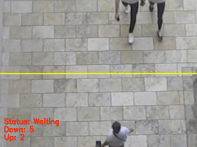

# BUS-SEAT-AVAILABILITY-USING-ML

In this project we created a “people counter” with OpenCV and Python. Using OpenCV, we’ll count the number of people who are heading “in” or “out” of a BUS in real-time.

# Required Python libraries for people counting
In order to build our people counting applications, we’ll need a number of different Python libraries, including:

NumPy,
OpenCV,
dlib,
imutils

# Combining both object detection and object tracking
Highly accurate object trackers will combine the concept of object detection and object tracking into a single algorithm, typically divided into two phases:

# Phase 1
Detecting: During the detection phase we are running our computationally more expensive object tracker to (1) detect if new objects have entered our view, and (2) see if we can find objects that were “lost” during the tracking phase. For each detected object we create or update an object tracker with the new bounding box coordinates. Since our object detector is more computationally expensive we only run this phase once every N frames.
# Phase 2 
Tracking: When we are not in the “detecting” phase we are in the “tracking” phase. For each of our detected objects, we create an object tracker to track the object as it moves around the frame. Our object tracker should be faster and more efficient than the object detector. We’ll continue tracking until we’ve reached the N-th frame and then re-run our object detector. The entire process then repeats.
The benefit of this hybrid approach is that we can apply highly accurate object detection methods without as much of the computational burden. We will be implementing such a tracking system to build our people counter.
